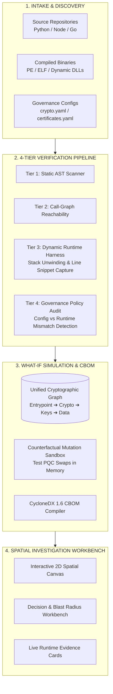

# WHAT IF: Cryptographic Posture & PQC Migration Simulator

[](https://nextjs.org/)
[](https://fastapi.tiangolo.com/)
[](https://csrc.nist.gov/projects/post-quantum-cryptography)
[](LICENSE)

> **Enterprise Cryptographic Discovery, Analysis & Transition Platform (ECDAT)**  
> *Transforming cryptographic migration from an operational gamble into a deterministic, simulated engineering sprint.*

---

## 💡 The Executive Pitch (For Judges)

### The Problem: The Post-Quantum "Cryptographic Cliff"
Every organization's digital security relies on public-key encryption (RSA, ECC, Diffie-Hellman). With the arrival of quantum computers, these algorithms will be cracked in seconds. Even worse, adversaries are executing **"Harvest Now, Decrypt Later" (HNDL)** attacks right now—stealing encrypted enterprise data today to decrypt it once quantum hardware matures.

Yet when CISOs and engineering leads look at their systems, they face **total cryptographic blindness**:
- They don't know where cryptographic primitives are buried across microservices and compiled binaries.
- Standard static scanners (SAST) generate thousands of noisy alerts on dead code, but **cannot prove whether vulnerable crypto actually runs in production**.
- No tool can answer the single most important question: **"If we upgrade this algorithm tomorrow, what will break?"**

### Our Solution: WHAT IF
We didn't try to "reinvent encryption" or write custom unproven crypto wrappers. Standard algorithms already exist. 

Instead, **WHAT IF illuminates, verifies, and governs enterprise cryptography**. It connects source code entrypoints to cryptographic operations, cloud key management systems (AWS KMS, Azure Vault), and protected data assets—giving teams an interactive sandbox to simulate post-quantum migrations and calculate their **cryptographic blast radius** before touching production code.

---

## 🌟 What Makes WHAT IF Unique? (Our USP)

If you are evaluating this platform as a judge, here is our key architectural innovation:

| Capability | Traditional Scanners (SAST/SCA) | Generic AI Security Bots | **WHAT IF Platform** |
| :--- | :--- | :--- | :--- |
| **Verification Depth** | Flags static text keywords (90% false positives). | Hallucinates advice without code grounding. | **4-Tier Empirical Verification:** Proves static AST presence, call-graph reachability, and **live runtime execution proof with line-level code snippets**. |
| **Impact Modeling** | Zero blast radius awareness. | Static text summaries only. | **What-If Simulation Sandbox:** In-memory counterfactual testing of algorithm upgrades, estimating breaking services and transit latency changes. |
| **Contextual Graph** | Disconnected list of file paths. | Chat text window. | **Interactive Spatial Investigation Canvas:** 2D interactive node-graph connecting entrypoint $\to$ crypto call $\to$ KMS key $\to$ PII data. |
| **Audit Compliance** | Generic CSV exports. | Markdown snippets. | **CycloneDX 1.6 CBOM:** Generates deterministic, audit-ready Cryptographic Bills of Materials. |
| **Governance Drift** | Blind to configuration files. | Cannot correlate configs. | **Configuration Mismatch Engine:** Automatically alerts when code declares AES-256 in policy but silently runs weak RSA or 3DES at runtime. |

---

## 🏗️ How It Works: Architectural Overview



### The 4-Tier Verification Continuum
1. **Tier 1 (Static AST):** Parses syntax trees to find cryptographic library calls and hardcoded secrets.
2. **Tier 2 (Reachability):** Uses graph traversals to confirm an active API endpoint can reach the code.
3. **Tier 3 (Runtime Observed):** Dynamically hooks cryptographic invocations, unwinds the Python call stack, and captures the exact executing code line snippet as irrefutable proof.
4. **Tier 4 (Policy Verification):** Validates runtime reality against enterprise governance policies (`crypto.yaml`) to detect dangerous configuration drift.

---

## 🔬 How We Scan Binaries & Libraries

### 1. Compiled Binaries (C/C++, Go, Rust, Windows `.dll`, Linux `.so`)
Even when source code isn't available, WHAT IF inspects native binaries:
- **Format Inspection:** Parses PE (Windows), ELF (Linux), and Mach-O (macOS) headers and sections.
- **Dynamic Symbol Linkage:** Detects dynamic imports and exports for OpenSSL (`libcrypto.so`), BoringSSL, and Windows CryptoNG (`bcrypt.dll`).
- **Cryptographic Constants:** Identifies hardcoded cryptographic artifacts (AES S-Boxes, SHA round constants, ECC curve parameters) inside `.rodata`.
- **Embedded Keys & Certs:** Scans binary segments for embedded PEM headers and raw X.509 ASN.1 certificate structures.

### 2. Software Dependencies & Libraries
- **Lockfile & Manifest Parsing:** Resolves direct and transitive dependency trees across `pyproject.toml`, `package.json`, `pnpm-lock.yaml`, `uv.lock`, and `go.mod`.
- **Cryptographic Taxonomy:** Correlates dependencies against our NIST PQC Deprecation Taxonomy (distinguishing primitive providers, transport wrappers, and cloud KMS clients).
- **Import Reachability:** Validates whether the imported library's cryptographic functions are actually called by the application.

---

## ⚡ Quick Start: Running Locally

### Prerequisites
- Python 3.12+ (or Python 3.13)
- Node.js 18+ (Node 20+ recommended)
- `pnpm` or `npm`

### 1. Start the FastAPI Backend Orchestrator
```bash
# In the project root:
python -m uvicorn services.api.main:app --port 8000 --host 127.0.0.1
```
*The API will start at `http://127.0.0.1:8000` with Swagger docs available at `/docs`.*

### 2. Start the Next.js Investigation Frontend
```bash
# In another terminal:
cd apps/web
npm install
npm run dev
```
*Open `http://localhost:3000` in your browser.*

### 3. Explore the Prototype Walkthrough
1. **Dashboard Overview:** View enterprise cryptographic health, quantum readiness score, and protected data classifications.
2. **Trigger a Scan:** Select the demo enterprise project and click **Start Scan** (or toggle *Include Runtime Telemetry*).
3. **Inspect Real Runtime Proof:** Navigate to **Findings** $\to$ click on the **RSA-2048 finding** $\to$ scroll to **Section 4: Runtime Observation & Telemetry** to view the live execution badge and exact code snippet captured by our harness.
4. **Spatial Investigation Canvas:** View the interactive 2D node graph connecting services, algorithms, KMS keys, and data assets.
5. **What-If Simulation:** Open the **Decision Workbench**, simulate upgrading RSA-2048 to **ML-KEM-768**, and see the immediate blast radius and migration effort.

---

## 📂 Repository Structure

```
WHAT_IF/
├── apps/
│   └── web/                   # Next.js 15 frontend with spatial graph canvas & workbench
├── services/
│   └── api/                   # FastAPI backend orchestrator & context engine
├── packages/
│   ├── analyzer/              # Static AST scanner, reachability, and certificate/key parsers
│   ├── analysis/              # Deterministic analysis engine, What-If simulator, and CBOM compiler
│   └── runtime/               # Dynamic telemetry harness with callstack unwinding
├── infra/
│   └── database/migrations/   # Database schema & migrations (SQLite WAL mode / PostgreSQL ready)
├── docs/
│   ├── DOC_WHAT_IF.md         # Comprehensive System Bible, PRD & Technical Spec
│   └── ARCHITECTURE.md        # Technical architecture details
├── TASK_11_COMPLETION_REPORT.md  # Milestone report: Analysis Engine & CBOM
├── TASK_12_COMPLETION_REPORT.md  # Milestone report: Runtime Evidence Pipeline
└── tests/                     # Unit and integration test suites
```

---

## 🎯 The Judge's Takeaway: Why WHAT IF Matters

> *"Most security tools tell you what is broken. WHAT IF proves what is actually running, flags where your policies are lying to you, and simulates the exact blast radius of fixing it before you write a single line of migration code."*

For in-depth product requirements, system specifications, and complete data flow diagrams, see [docs/DOC_WHAT_IF.md](file:///c:/Users/boltr/Desktop/WHAT_IF/docs/DOC_WHAT_IF.md).
